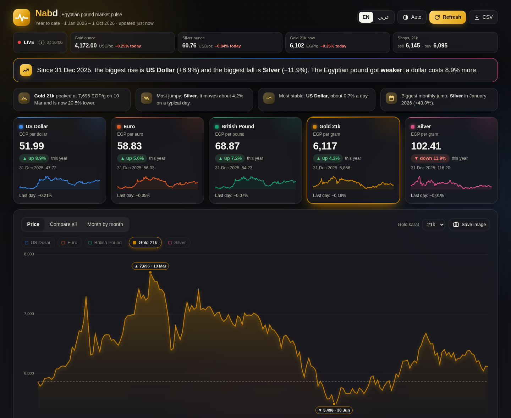
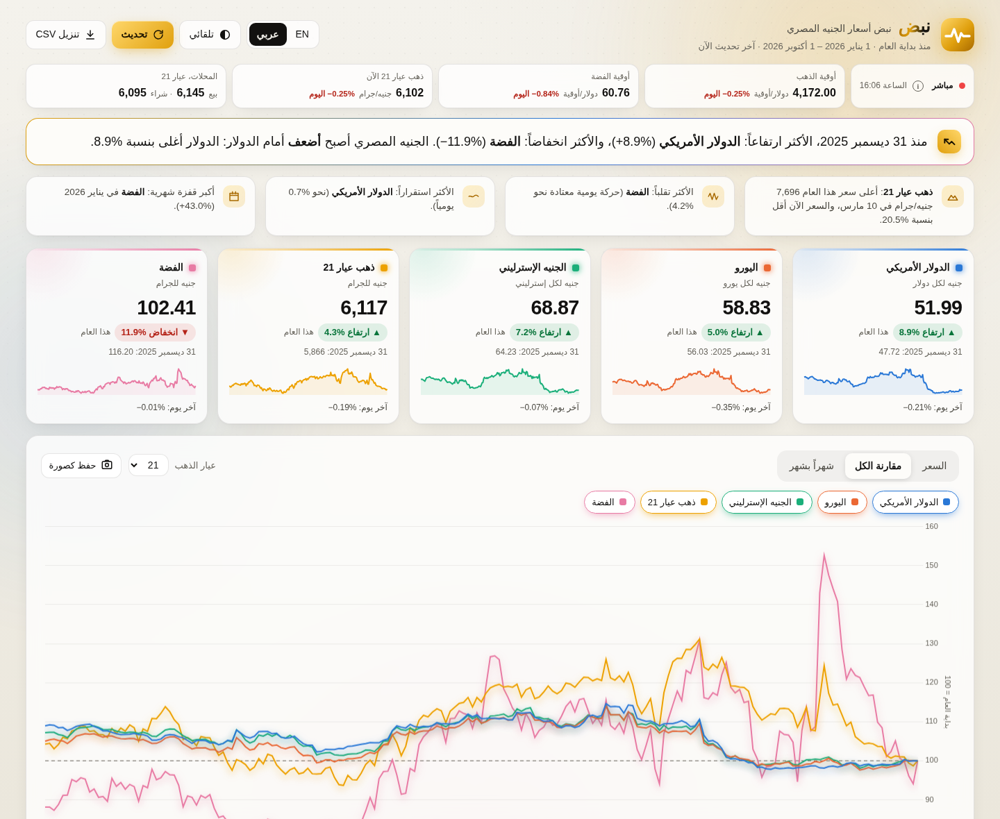
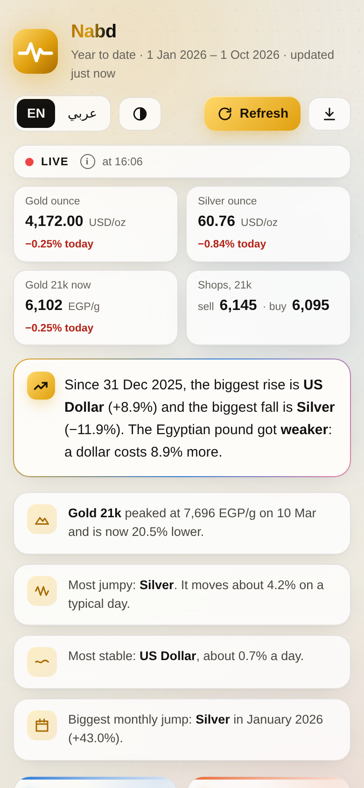
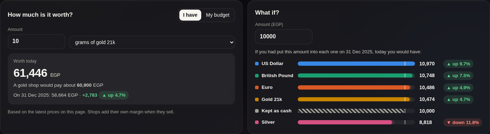

<div align="center">


# Nabd · نبض

**The Egyptian pound market pulse.** Gold, silver, US dollar, euro and pound sterling, priced in Egyptian pounds, year to date, explained in plain words.

[](https://github.com/ahmedosama181/nabd/actions/workflows/tests.yml)
[](LICENSE)


**[⬇ Download the latest version (ZIP)](https://github.com/ahmedosama181/nabd/archive/refs/heads/main.zip)** · [Releases](https://github.com/ahmedosama181/nabd/releases/latest) · [How to run it](#-quick-start) · [بالعربي](#-بالعربي)



</div>

## ✨ What it does

Nabd is a small app that runs on your own computer and opens in your browser. It shows how the prices Egyptians care about have moved since the start of the year, in language anyone can follow.

- **Live prices**: real-time gold and silver, gold per gram in EGP for your karat, and what Egyptian gold shops sell and buy at (updates every minute).
- **Plain-language summary and insights**: what rose most and fell most, whether the pound got stronger or weaker, the year's peak and how far below it gold is now, the most jumpy and most stable asset, streaks.
- **Five price cards**: today's price, % up or down this year, the 31 December price, a trend line and the last day's change.
- **One chart, three views**: *Price* (with the year's highest and lowest points marked), *Compare all* (everything starts at 100), *Month by month*. Every tooltip shows the % change. Save any chart as an image.
- **"How much is it worth?"**: grams of gold (24k / 21k / 18k), Egyptian gold pounds (8 g of 21k), silver or foreign cash, converted to EGP, with what a gold shop would pay and the change since 31 December. Or the reverse: what your budget buys.
- **"What if?"**: what an amount would be worth today if you had put it into each asset on 31 December, compared with keeping cash.
- **All the numbers** for those who want them: change over 1 / 7 / 30 days, highs and lows, averages, daily swing, biggest drop, best and worst month, what moved each price, daily data table, CSV export for Excel.
- **English and Arabic**, with a true right-to-left layout in Arabic (numbers stay 0-9), light / dark / automatic theme, phone-friendly.

<table>
<tr>
<td width="62%"></td>
<td width="38%"></td>
</tr>
<tr><td colspan="2"></td></tr>
</table>

## 🚀 Quick start

1. **[Download the ZIP](https://github.com/ahmedosama181/nabd/archive/refs/heads/main.zip)** and unzip it.
2. Open the folder and start Nabd:

| | What to do | First time only |
|---|---|---|
| **macOS** | Double-click **`Start-Mac.command`** | macOS blocks downloaded scripts ("Apple could not verify…"). Open **System Settings → Privacy & Security**, scroll to *Security* and click **Open Anyway**. On macOS 15+ right-click → Open no longer works. |
| **Windows** | Double-click **`Start-Windows.bat`** | If SmartScreen says "Windows protected your PC", click **More info → Run anyway**. |

Your browser opens Nabd at `http://127.0.0.1:8765/`. To stop it, close the terminal window that opened with it.

**You don't need to install anything.** If the computer has no Python 3.8+, the launcher downloads a private, portable copy into the `runtime/` folder the first time (no admin password, nothing installed system-wide; delete the folder to remove it). Nabd itself only uses Python's standard library.

| | Portable Python | Integrity check |
|---|---|---|
| Windows | python.org "embeddable" Python 3.12.10 (~11 MB) | SHA-256 pinned in [`tools/bootstrap-windows.ps1`](tools/bootstrap-windows.ps1) |
| macOS | python-build-standalone 3.12.14 (Apple Silicon or Intel, ~20 MB) | SHA-256 checked against the release's `SHA256SUMS` |

Prefer the terminal? `python3 app.py` (macOS/Linux) or `py -3 app.py` (Windows). Options: `--port 9000`, `--no-browser`.

## 🔢 How the numbers are calculated

- **Gold and silver in EGP per gram** = global price in USD per ounce × USD/EGP ÷ 31.1035 (grams in a troy ounce). Gold 21k = 24k × 21/24, 18k = 24k × 18/24. Silver is pure (999). An Egyptian **gold pound** = 8 g of 21k.
- **Euro and pound sterling in EGP** = EUR/USD (or GBP/USD) × USD/EGP.
- **Year to date** = latest price vs the price on 31 December of last year.
- **Month by month** = each month's last price vs the previous month's last price (January starts from 31 December; the current month is marked "so far").
- Daily values are the rates published once a day (spot prices), not exchange closing prices. Weekends and holidays carry the last known price forward in the charts; the statistics use real trading days only.

## 🌐 Data sources

| Data | Source | Notes |
|---|---|---|
| Daily history: USD/EGP, EUR, GBP, gold and silver | [currency-api](https://github.com/fawazahmed0/exchange-api) daily rate files (jsDelivr, mirrored on Cloudflare Pages) | Primary source; one consistent source for every series |
| Backup history | Yahoo Finance; Frankfurter (ECB) for EUR and GBP | Only if the daily rates can't be reached. Yahoo often answers scripts with HTTP 429 ([yfinance #2422](https://github.com/ranaroussi/yfinance/issues/2422)), so Nabd then skips it for 3 hours |
| Live gold and silver | [gold-api.com](https://gold-api.com/docs) | Free, no key; asked once a minute while the page is open |
| Egyptian gold shop prices | egypt.gold-price-today.com, then edahabapp.com | Read from their public pages every 10 minutes while the page is open |

A price series never mixes sources: if one has to change, that series' whole year is downloaded again from the new source, so the charts never show a fake jump.

## 🔒 Privacy

Nabd runs entirely on your computer. There are no accounts, no tracking and no analytics. It only downloads public prices from the sources above. Your settings stay in your browser, and the prices are saved in `data/store.json` (about 30 KB). Only the current year is kept, plus the 31 December price; on 1 January the saved prices are cleared and the new year starts fresh.

## 🛠 Troubleshooting

| Problem | Fix |
|---|---|
| macOS: "Apple could not verify…" | System Settings → Privacy & Security → **Open Anyway** (once). Or run `xattr -dr com.apple.quarantine ` followed by the Nabd folder in Terminal. |
| "TLS certificate check failed" (Mac with python.org Python) | Run `Install Certificates.command` from `/Applications/Python 3.x/` once. |
| Port 8765 is busy | Nabd picks the next free port and prints the address. |
| No internet | Nabd shows the last saved prices with a notice and tries again later. |
| A section is empty | That source didn't answer; everything else keeps working. Press **Refresh** later. |

## 🧑‍💻 For developers

```bash
python3 app.py --no-browser                     # run the server
python3 -m unittest discover -s tests -t .      # offline tests
```

```
app.py              local web server (standard library only)
tracker/
  sources.py        data sources: daily rates, live prices, backups, gold-shop scraping
  collect.py        the yearly store, incremental updates, live endpoint, CSV export
  analysis.py       EGP conversion and all KPIs (pure functions)
  fetch.py          small HTTP helper with retries
web/                the page: index.html, style.css, app.js (+ Chart.js in web/vendor)
tools/              portable-Python setup for Windows
Start-Mac.command   macOS launcher (also sets up Python if needed)
Start-Windows.bat   Windows launcher (also sets up Python if needed)
```

Contributions are welcome. See [CONTRIBUTING.md](CONTRIBUTING.md). Version history is in [CHANGELOG.md](CHANGELOG.md).

## 🇪🇬 بالعربي

**نبض** أداة مجانية تعرض أسعار **الذهب والفضة والدولار واليورو والجنيه الإسترليني بالجنيه المصري منذ بداية العام**، مع شرح مبسّط ورسوم بيانية واضحة، وأسعار مباشرة، وحاسبة لقيمة الذهب (بالجرام أو الجنيه الذهب)، وتعمل باللغتين العربية والإنجليزية.

**طريقة التشغيل:**

1. [حمّل الملف المضغوط](https://github.com/ahmedosama181/nabd/archive/refs/heads/main.zip) وفك الضغط.
2. على **ماك**: اضغط مرتين على `Start-Mac.command`. في أول مرة: إعدادات النظام ← الخصوصية والأمان ← **فتح على أي حال**.
3. على **ويندوز**: اضغط مرتين على `Start-Windows.bat`. لو ظهرت رسالة الحماية: **More info ← Run anyway**.

لا تحتاج لتثبيت أي شيء: لو الجهاز ليس عليه بايثون، تقوم الأداة بتحميل نسخة خاصة بها تلقائياً في أول تشغيل. الأداة تعمل على جهازك فقط، بدون حسابات أو تتبع.

## 📄 License and contact

Released under the [MIT License](LICENSE) © 2026 **Ahmed Osama**. Third-party components and data services are listed in [THIRD_PARTY_NOTICES.md](THIRD_PARTY_NOTICES.md).

Questions, ideas or feedback: **[ahmedosama181@outlook.com](mailto:ahmedosama181@outlook.com)**, or open an [issue](https://github.com/ahmedosama181/nabd/issues).

> For information only, not financial advice. Prices come from free public sources and can differ from what a bank or shop quotes.
